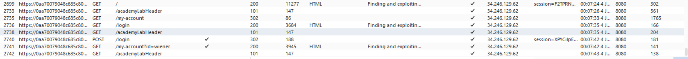
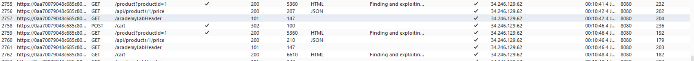
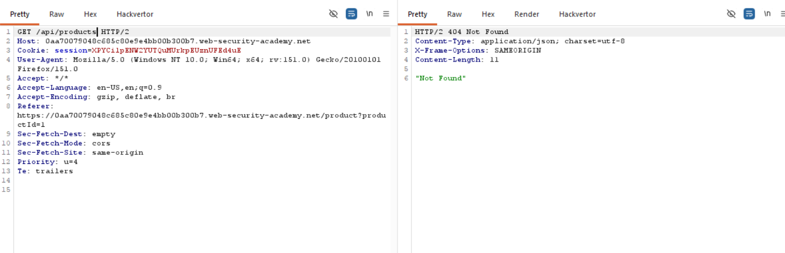
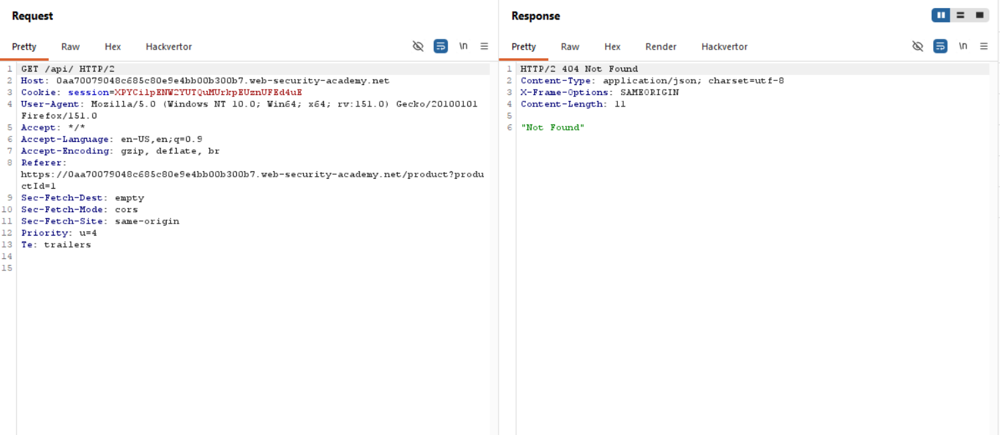
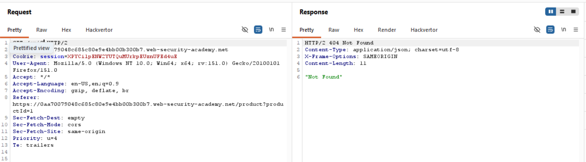
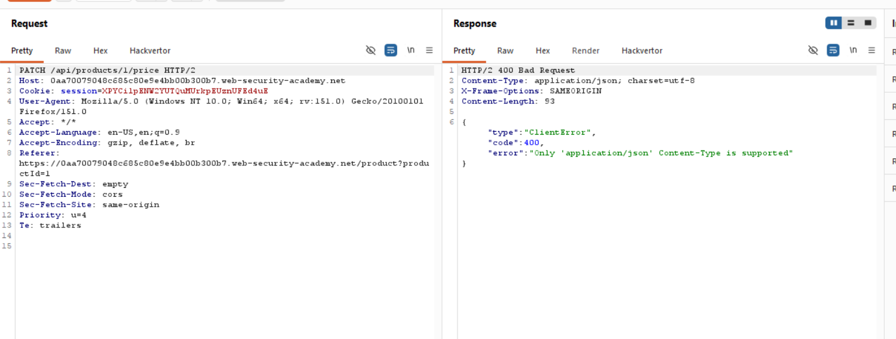
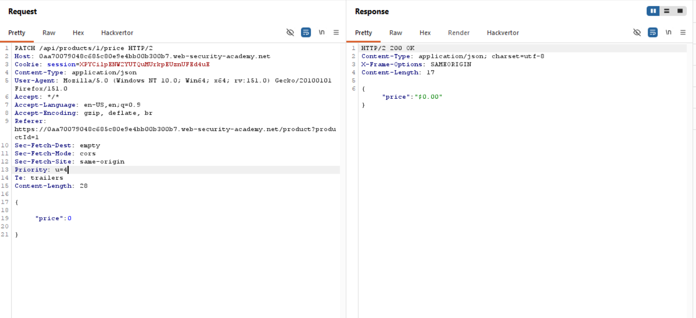

Title: Finding and exploiting an unused API endpoint

Objective:to delete the user carlos

first lets login with the credentials give wiener:peter we can see the endpoints in the HTTP History

there is nothing intresting then we will chnage the email,add to cart an item also and then see if we can find and API endpoint.

here we can see that there is an api fo rthe product price now lets check every path.

we are not able to find the RESTapis so we will now change the HTTP headers and check.

now add the content type in teh patch request as well as a body tha we get in the GET request. and then i have deleted the message part and changed the value o price to 0.

ow we can go and buy the jacket for free to complete the lab

