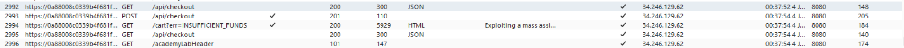
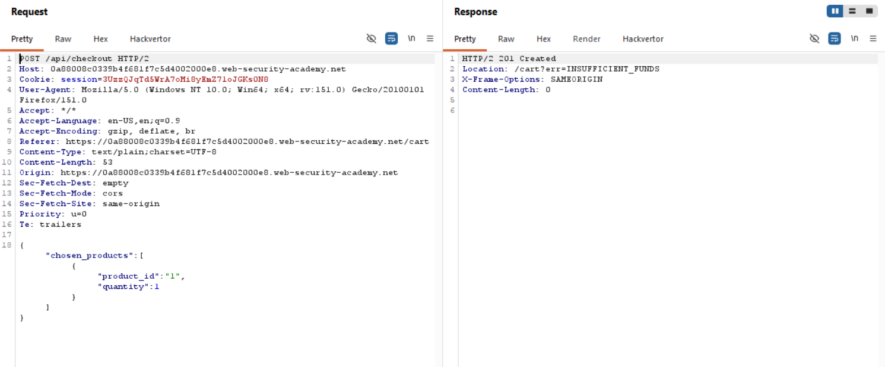
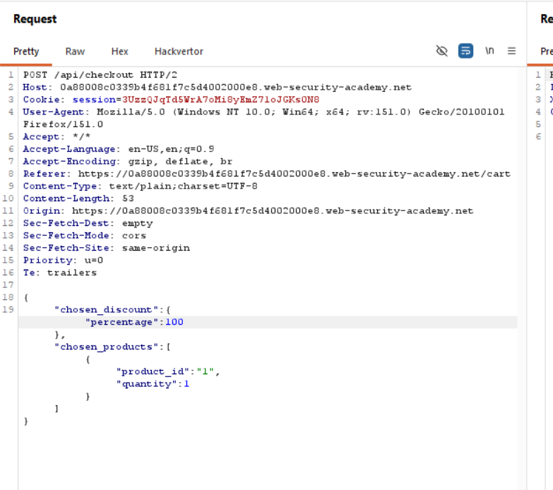

Title:Exploiting a mass assignment vulnerability

objective:to buy a leather jacket for free

we will first do everything we cna on the website like making an account,changing email,add to cart,buying,removing and see if we can find an endpoint.

as we can see there is a checkout api 

this image ster we clicked checkout 

here we can see that we have a different parameter discount we can add it to teh checkoutt before with 100% discount and buy  the jacket for free

and when we click send we get a 201 created message after that we have succesded the lab

